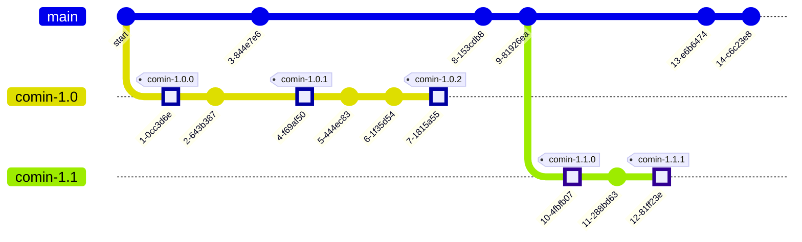

# Developer documentation

## Release workflow

Release procedure for ComIn releases:

- The `main` branch contains all recent changes, ie. it is "unstable"
- When a new release is upcoming, a release branch `comin-X.Y`  is created.
- Right after the creation of the release branch, the version number in the `main` branch is increased
- New features do not enter this release branch. Only bug fixes (patches) are allowed to be added to the `comin-X.Y`  branch.
- A release is published then as a tag `comin-X.Y.Z`  (including the patch level)
- as a policy, no feature backports are provided. Bug fixes (patches) are applied only to the current release and to the release which is currently used by the current ICON version.

The releases are created automatically by GitLab CI if a commit with a tag of the form `comin-x.y.z` is created. Please ensure that the commit met the following conditions:
- The version number in the `CMakeLists.txt` must match the version number of the commit.
- The commit must be contained in the branch `comin-x.y`

## Updating the replay data

The replay data can be updated semi-automatically. The following steps need to be executed:

- create a feature branch in ComIn (and push if to the Gitlab repository)
- create a feature branch in ICON referencing the ComIn feature branch (and push it to a Gitlab repository)
- run the CI pipeline manually (Build->Pipelines->Run pipeline)
  - set the variable `ICON_BRANCH` to the name of the icon feature branch.
  - set the variable `ICON_REPO` to the ssh url for cloning the ICON repository. (default: `git@gitlab.dkrz.de:icon/icon.git`)
- Run the pipeline
  - The job `generate_replay_data` will create an artifact `predef_replay_data.cmake`
  - download the file and replace it in the comin repository (`replay_tool` subdirectory)

## Pre-commit hooks

Pre-commit hooks are tests that run every time you try to commit. A very basic test is to check for lines containing trailing whitespace, or to apply the `fprettify` auto-formatter for modern Fortran code.

### Running pre-commit hooks locally

You will need to have the pre-commit package manager installed, see https://pre-commit.com for instructions. The next time you run git commit, the hooks listed in `.pre-commit-config.yaml' will be executed.

### Gitlab CI/CD pipeline

Whenever changes are pushed to the GitLab server, the CI/CD pipeline also runs the pre-commit hook scripts. The intention here is to catch formatting problems while they are in a feature branch. They would need to be fixed before merging into the main branch.

### Conventional commit messages (currently disabled)

A different set of pre-commit hooks is run for merge requests: The `pre-commit-config.merge.yaml` file tests whether commit messages contain certain structural elements: `fix:`, `feat:`, `chore:`, etc., making it easier to create release changelogs, for example. See https://www.conventionalcommits.org/en/v1.0.0/ for details.
The tests for conventional commit messages use the Cocogitto toolbox (https://github.com/cocogitto/cocogitto). *Note: these checks are currently disabled!*
