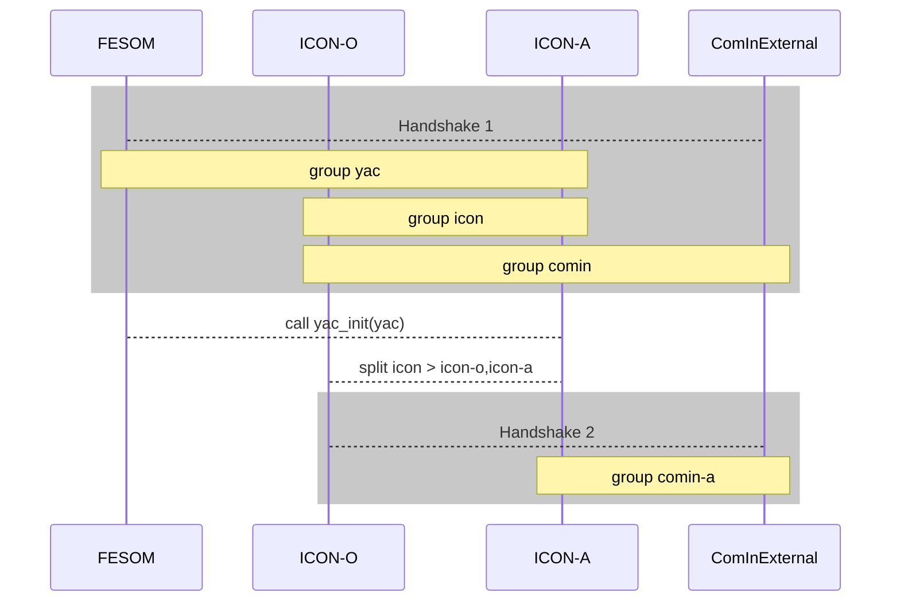

# ICON Community Interface :: Technical Documentation

@tableofcontents{html:2}

The Community Interface (ComIn) organizes the data exchange and simulation events between the ICON model and "3rd party modules". The concept can be logically divided into an **Adapter Library** and a **Callback Register**.

1. **Adapter Library**: It is included in both, the ICON model and the 3rd party module. It contains descriptive data structures, and regulates the access to existing and the creation of additional model variables.
2. **Callback Register**: Subroutines of the 3rd party module may be called at pre-defined events during the model simulation.

Code contributions from different researchers and institutions ("third-party code") are usually not included in the main ICON code, but remain confined to project branches. In any case, they add specific switches and calls to ICON's main loop, making the model code less readable. Additional maintenance is required to keep the third-party code compatible with new versions of ICON. These problems are solved by providing a unified plugin interface. While the core model remains unchanged, third-party code can be run alongside ICON, even if it is implemented in a programming language other than Fortran.


**User Guide:** This document contains a detailed technical specification of the interfaces. For beginners (users), we recommend reading the [User Guide](user_guide.md) documentation first.

**Usage example:** The ComIn library is distributed with a standalone emulator `minimalexample`. This prototype implementation can be found in the file `minimal_example.F90`.


---


## General remarks

*Clarification of terms I:* In this document, we use the phrase "3rd party module" and the term "plugin" interchangeably.

*Clarification of terms II:* There is a fundamental difference between this community interface and a coupling software, e.g. [YAC](https://dkrz-sw.gitlab-pages.dkrz.de/yac/): A coupler technically moves the data between interacting component models. However, this does not solve the question of how to add this interaction in a non-intrusive way to ICON. This is the purpose of the community interface, which exposes ICON's data structures in an organized way and controls what, how and when foreign functions are called and data is exchanged. The concept of a community interface and the coupling software complement each other: One may think of the coupling software as the technical sub-layer when, for example, interpolation or parallel communication is required.

The adapter library allows the 3rd party module(s) to be built separately from the ICON model.

- The ComIn library is published separately from the ICON model code. For the sake of simplicity, however, the library will also be distributed together with ICON.
- The MPI library is a prerequisite for using the ComIn library. Plugins, however do not necessarily have to be built with MPI support.
- The interfaces of the adapter library support multiple computational domains ("*logical* domain IDs", i.e. the intrinsic ICON grid refinements).
- The data flow from/to the 3rd party module is *a priori* known to the ICON model (before the model integration but not before the simulation). This allows the handling of parallel synchronization.
- The basic guideline for development was that the size of the adapter library should be *minimal*. Furthermore, the amount of data that needs to be provided by the ICON model should be minimal.


### Language interoperability

The adapter library is implemented in Fortran 2003, but interfaces are provided for plugins that are written in C/C++ and Python.

In order to support this language interoperability, the `BIND(C)` attribute is required for some publicly accessible Fortran data structures. This also implies that all public procedures of the ComIn have to be non-type-bound, because calling type-bound procedures via ISO-bindings is not supported by the Fortran standard.
Some internal types containing `POINTER`s, `ALLOCATABLE`s or `CHARACTER`s are not defined with the `BIND(C)` attribute. Instead, access functions to the components of these data type are provided.

Note that combining ICON ComIn with a coupler software already offers another technical solution for language interoperability: Through an adapter, the ComIn mechanism can be used to feed an externally running receiver process with ICON data. This software may be written in C.


### Limitations

- In the current version, the adapter library allows the access to *cell-based* ICON data fields, `REAL(wp)` arrays only. This implies in particular that data structures and arrays related to interpolated latitude-longitude grids are not exposed to the adapter library. However, geometrical information of vertices and edges, which is required for, e.g., interpolation, are provided.
- For each variable the adapter library allows access to the process-local MPI partition only. Furthermore, most ICON-internal MPI communicators and exchange patterns are not exposed to 3rd party module(s). Only the MPI communicator which contains all MPI PEs (*P*rocessing *E*lements, is used here synonymously with the term MPI task) taking part in the primary constructor calls (ICON worker PEs) is exposed via the interface.
- The implementation of the function callbacks aims at a coarse-grained level with a moderate calling frequency (i.e. several times per time step but not dozens of times). In particular, callbacks are not intended to be used below ICON's "block-loop level".

Not yet implemented in the current version of ICON ComIn:
- The negotiation of a processing order between multiple plugins has not yet been implemented. Callbacks are organized in the order in which they have been registered.
- The synchronization flag `COMIN_FLAG_SYNCHRONIZED` for the access of variables is currently not supported. In later versions of ComIn, users may signal by this flag that the host model should perform a halo exchange.


### Versioning information and compatibility

The ComIn library uses semantic versioning (https://semver.org), which encodes a version by a three-part version number `(Major.Minor.Patch)`.
As a convention, the major version has to match between ComIn, the ICON model, and the 3rd party modules for correct interaction. The minor version should be backward compatible.

*Example:* A 3rd party module using ComIn v1.1 capabilities should still work with ComIn v1.2.

As many components of the development are still in the testing phase, the initial public release is set to version number 0.1.0.

Both, the 3rd party modules and the host model (ICON), are built independently and may be related to different versions of ICON ComIn.
ComIn uses the SONAME to ensure that the library that is loaded at runtime is compatible with the version, that was used at compile time. E.g. `libcomin.so.1` is the library name of the ComIn version 1.x.y.
When loading a 3rd party module, it is explicitly checked that the major versions of the ComIn library that is used by the host model and the one that is used by the 3rd party library match.

The user can obtain the version information for the ComIn library that is used at runtime (loaded by the host model at startup) by calling the function @ref comin_setup_utils::comin_setup_get_version() "comin_setup_get_version()", which returns an object of type `t_comin_setup_version_info`:

```fortran
  TYPE :: t_comin_setup_version_info
    INTEGER :: version_no_major, version_no_minor, version_no_patch
  END TYPE t_comin_setup_version_info
```


#### API compatibility and ABI compatibility

Data structures for the transfer of data between the host and the plugin are allocated once by the host. A pointer to these data structures is propagated to each of the plugins.
This approach fails if the plugin assumes a different structure for the data due to a different ComIn version at build time. This means: Changes in the ComIn data state result in ABI incompatibility, and therefore this requires a change of the major version number.

Of course, there is also the issue of API incompatibility, where functions and/or interfaces change. These also result in a change of the major revision number.

Note to ComIn developers: Introducing new global module variables with the intention of transferring data between the host and the plugin outside of the ComIn state module may corrupt the above mechanism! Therefore global module variables should be generally avoided.


### Namespaces and scopes

As a replacement for a namespace functionality, which is not available in the Fortran programming language, ComIn uses the prefix `comin_*` for all modules and public entities (internally and externally public).
The other part of the name follows this naming convention:

- **Procedures** are named `comin_<scope>_<method>`
- **Variables** are named `comin_<scope>_<description>`
- **Derived Types** are named `t_comin_<scope>_<description>`.

The naming element `<scope>` classifies the general context the object is used for. List of scopes (non-exhaustive): `setup`, `current`,  `callback`, `parallel`, `descrdata`, `var`, `errhandler`. The meaning of these different scopes will become clear from the descriptions below.


### Host and plugins

Although ComIn is designed specifically for ICON, the code should remain agnostic of the host model and the attached third party plugins. Thus, the driving host model (ICON) is simply referred to by `host` in the code and the third party plugins are referred to by `plugin`.

- **ComIn interface to ICON**
  A module named @ref host_interface "´comin_host_interface´" provides all procedures, variables and constants that are exposed to ICON. This module does not provide any actual implementation. Thus, it consists only of `USE` and `PUBLIC` statements.
  The convention is that from the ICON side, no other module than `comin_host_interface` must be used.

- **ComIn interface to plugins**
  A module named @ref plugin_interface "`comin_plugin_interface`" provides all procedures, variables and constants that are exposed to third party plugins. Again, this module does not provide any actual implementation. Thus, it consists only of `USE` and `PUBLIC` statements. The convention is that from the third party plugin side, no other module than `comin_plugin_interface` must be used.


### Error handling in functions and subroutines

By default ComIn calls @ref comin_errhandler::comin_plugin_finish on error, which is an exposed ICON subroutine (reverse callback): A function pointer to ICON's `finish` routine. It is initialized by the host model through the subroutine @ref comin_state::comin_setup_errhandler() "comin_setup_errhandler()". This setting is mandatory and must be done before calling the @ref comin_setup::comin_setup_check() "comin_setup_check()".

Plugins have the option to manage errors independently by setting @ref comin_errhandler::comin_error_set_errors_return to .TRUE.. If this is the case, ComIn will not automatically call @ref comin_errhandler::comin_plugin_finish. Instead, the API call will return. The plugin will then need to verify every execution's success by obtaining the error code with @ref comin_errhandler::comin_error_get and comparing it to COMIN_SUCCESS. The relevant error message can be queried with @ref comin_errhandler::comin_error_get_message.

## Adapter library

### Access to model variables

Access period: Access to model variables is possible in the 3rd party module's *secondary* constructor (see below) and all subsequent subroutine callbacks. The contents of the model variables might change between callbacks.

The following information is required to describe (and uniquely identify) a model variable in ICON:
```fortran
TYPE :: t_comin_var_descriptor
  CHARACTER(:),ALLOCATABLE :: name  !< ICON-internal short name
  INTEGER                  :: id    !< logical domain ID
END TYPE t_comin_var_descriptor
```

Encapsulation of this information into a (constant) data structure of the data type `t_comin_var_descriptor` is necessary for two reasons: a) iterating over the list of available variable is simplified, and b) future extensions, e.g. to lat-lon variables, are possible without changing 3rd party code.

Remarks:
- The variable descriptor does not contain information about whether the variable is a "standard field" or a tracer, the latter corresponding to an `add_ref` in ICON. Unique names are required here, while information about a variable's nature can be retrieved from its metadata (see section [metadata](#metadata)).
- The `t_comin_var_descriptor` denotes an ICON variable and does not contain information about a specific 3rd party module. As a consequence, new variables that are added to ICON have to be unique, and this also applies in the case of multiple active plugins. Conflicting variables between different modules can result in a runtime abort (more details are described below in the section [Creating additional model variables](#creating-additional-model-variables)).
- Not all ICON variables are necessarily provided to the 3rd party modules. The set of exposed data fields is not defined by the adapter library (and its version) but by the ICON model and may even depend on ICON runtime settings.

The variable descriptor is stored alongside with the data array (pointer) and metadata in a data structure of the internal type @ref comin_variable_types::t_comin_var_item "t_comin_var_item":
```fortran
TYPE :: t_comin_var_item
  TYPE(t_comin_var_metadata)      :: metadata
  TYPE(t_comin_var_ptr), POINTER  :: p  => NULL()
END TYPE t_comin_var_item
```

The list of available (model) variables is managed in an internal data structure of the adapter library (variable list `comin_var_list` in @ref comin_state::t_comin_state "t_comin_state"). Note that the derived data type @ref comin_variable_types::t_comin_var_item "t_comin_var_item" is not exposed to the host model or the plugins. ComIn plugins, for example, can access the data members via the subroutines @ref comin_variable::comin_var_get_descr_list_head() "comin_var_get_descr_list_head()", @ref comin_variable::comin_var_get() "comin_var_get()", and @ref comin_metadata::comin_metadata_get() "comin_metadata_get()", see [Iteration](#iterating-over-variables) and [Metadata](#metadata).

The ICON model (host code) accesses the list of exposed variables with procedures for adding variables, and for removing the entire variable list, freeing the memory.
```fortran
SUBROUTINE comin_var_list_append(p)
  TYPE(t_comin_var_ptr),        POINTER     :: p
END SUBROUTINE comin_var_list_append

SUBROUTINE comin_var_list_finalize()
END SUBROUTINE comin_var_list_finalize
```

#### Read/Write access

Access to ICON data fields happens via an accessor function @ref comin_variable::comin_var_get "comin_var_get". This subroutine is intended to be called in the secondary constructor of the 3rd party module (see [Secondary constructor](#secondary-constructor)). It may not be called at an earlier or later time, and it serves the purpose of associating internal variable pointers of the 3rd party module to the ICON internal memory.

Basically, `comin_var_get(context, var_descriptor, flag, var_pointer)` returns a 5-dimensional `REAL(wp)` pointer `var_pointer`. A return value `var_pointer /= NULL` means "success". The index ordering is defined within the ICON model and may change between different versions of the community interface. The interpretation of the different array dimensions is mostly left to the user.

*Remark (array blocking).* In ICON, for reasons of cache efficiency nearly all `DO` loops over grid cells, edges, and vertices are organized in two nested loops: "jb loops" and "jc loops". Often, the outer loop `jb` is parallelized with OpenMP. With respect to the data layout, this means that arrays are split into several chunks of a much smaller length `nproma`. This array blocking is exposed via ComIn.

The type @ref comin_variable_types::t_comin_var_ptr "t_comin_var_ptr" provides dimension indices in the range 1,..,5 for the line (`jc`, `nproma`) and block dimension (`jb`) as well as the vertical dimension (`jk`). For tracer fields the position index `pos_jn` hold information about the tracer slice dimension (see below). Note that the index positions are translated to 0-based indexing for the C/C++ and the Python interfaces of ComIn.

**Convenience function @ref comin_variable::comin_var_to_3d "comin_var_to_3d" for accessing 2D/3D fields.**
In practice, access to fields can be simplified, under the condition that the sequence of dimensions is  `(jc,jk,jb)`. This exact dimension sequence is (currently) fulfilled by the ICON model. In this case, a 3D pointer variable `REAL(wp) :: slice(:,:,:)` can be generated directly from a variable of type `TYPE(t_comin_var_ptr)` using the function
```fortran
  FUNCTION comin_var_to_3d(var) RESULT(slice)
    TYPE(t_comin_var_ptr), INTENT(IN)  :: var
    REAL(wp), POINTER :: slice(:,:,:)
  END FUNCTION comin_var_to_3d
```
The Python interface implements this as a field property):
```python
variable = comin.var_get( ... )
slice = variable.to_3d
```
A similar function is available for C/C++:
```C
 variable = comin_var_get( ... );
 double* slice = comin_var_to_3d(variable);
```
Here, the additional restriction holds that array slices for `(jc,jk,jb)` have to be stored contiguously in memory, because only in this case can these variables be expressed by a simple base pointer.

Regarding the data array, the @ref comin_variable::comin_var_get "comin_var_get" accessor function returns a pointer to an auxiliary data structure `t_comin_var_ptr` which wraps the `REAL(wp)` pointer. This indirection allows to switch between "old" and "new" time levels: The distinction between "old" and "new" (`nnow`, `nnew`) states, which is available in ICON for some data fields, is not exposed to the adapter library. Instead, for these fields the exposed pointers are always associated with the latest modified state. To access an "old" time level, 3rd party modules should allocate local buffers.

```fortran
  TYPE :: t_comin_var_ptr
    TYPE(t_comin_var_descriptor) :: descriptor
    REAL(wp), POINTER :: ptr(:,:,:,:,:)
    INTEGER :: pos_jc = -1, pos_jk = -1, pos_jb = -1, pos_jn = -1
    INTEGER :: ncontained = 0
    LOGICAL(kind=c_bool) :: lcontainer = .FALSE.
  END TYPE t_comin_var_ptr
```

An ICON model variable is always requested within a `context`, i.e. an entry point where the model variable is accessed (named integer constant, see the section "Entry points" below). The accessor function @ref comin_variable::comin_var_get "comin_var_get" accepts a list of (possibly) multiple entry points: `INTEGER, INTENT(IN) :: context(:)`

Code example:
```fortran
  TYPE(t_comin_var_ptr), POINTER :: p
  CALL comin_var_get(context, var_descriptor, flag, p)
```

Important note: The access for the context `EP_SECONDARY_CONSTRUCTOR` is excluded for the subroutine @ref comin_variable::comin_var_get "comin_var_get", since the variables of the host model do not have to be formally assigned with meaningful values at the time of execution of the secondary constructor.

The optional argument `flag` provides information w.r.t. the data flow. Flags may be combined like `flag = IOR(COMIN_FLAG_READ, COMIN_FLAG_WRITE)`. Technically, this can be realized as follows:

```fortran
 ! (note that these flags represent bit positions!)
 ENUM, BIND(C)
 ENUMERATOR :: FLAG_NONE = 0, &
   & COMIN_FLAG_READ         = IBSET(0,1), &
   & COMIN_FLAG_WRITE        = IBSET(0,2), &
   & COMIN_FLAG_SYNCHRONIZED = IBSET(0,3), &
   & COMIN_FLAG_DEVICE       = IBSET(0,4)
 END ENUM
```
Please note that as described in the [section on Limitations](#limitations) above: "The synchronization flag `COMIN_FLAG_SYNCHRONIZED` for the access of variables is currently not supported."
If no `flag` is provided, read/write access to a non-synchronized field is assumed, i.e. the values in the halo region of the domain may be uninitialized or invalid, depending on the entry point and the particular field.
Illegal write access to a data field is not detected by the ICON model due to efficiency reasons. In theory, this could be achieved by a debug version (compile-time switch) of the adapter library, which would allocate and compare local buffers.
The flag `COMIN_FLAG_DEVICE` indicates that the plugin will access the device pointer. If this flag is passed, comin will *not* synchronize the data from the device to the host before the callbacks are called.


#### Tracers

In some modules of the ICON code, e.g. the tracer module, there is a need for handling multiple variables at once, located in contiguous storage. These are called model variable containers. For tracer fields (or possibly other container variables) the subroutine `comin_var_get` returns an array pointer to the slice of the container in which the tracer lives.
Alternatively, in order to access the container array itself, the subroutine `comin_var_get` may be called directly for the container variable "tracer". More precisely, the Fortran language API returns an object of type `TYPE(t_comin_var_ptr)`. This provides for individual tracer fields, e.g. `qv`, the slice index `ncontained`, corresponding to the tracer's position in the container array. For the container array, indicated by the logical flag `lcontainer=.TRUE.`, the tracer's slice equals `tracer%ptr(:,:,:,:,qv%ncontained)`. The position of the slice index dimension is provided by `tracer%pos_jn`.
Note that tracer variables in ICON have multiple time levels.


#### Turbulent & convective transport of tracers

By setting the logical metadata switches `tracer_turb` and `tracer_conv` (see section on [metadata](#metadata) for more information), tracers requested by a plugin can be added to the calculation of turbulent or convective transport tendencies.
Please note the following remarks:
- ICON's turbulence/convection parameterization needs to be capable of calculating the tendencies for additional tracers. This is currently the case for `inwp_turb=1`/`inwp_convection = 1`. There are no checks done for this.
- Updating the mass mixing ratios of tracers requested by a plugin with the tendencies calculated by ICON's physical parameterizations is neither done by ICON nor ComIn. Dealing with these updates is thus left to the plugin. A `comin_request_add_var` with `tracer_turb=.TRUE.` and/or `tracer_conv=.TRUE.` requests an `add_var` of a variable for the respective tendency in addition. Pointers to these additional tendency variables can be accessed by plugins like any other variable. The naming conventions are `ddt_<tracername>_turb` and `ddt_<tracername>_conv`. Please note that in ICON these tendency variables are stored in containers. As a tracer is not necessarily subject to convective or turbulent transport, the indexing of the different containers might differ.

#### A word of caution: Undefined behavior when accessing output diagnostics

It can be dangerous for a third party module to request an ICON field which is only diagnosed at output time steps. A known example is the mean sea level pressure `pres_msl`. If such a field is used as input for additional computations, results will depend on the output frequency specified in the ICON namelist. Registering such a field for restart in order to save its state is of course possible, but will not solve the problem. Currently, the only solution would be to manually set the fields' update frequency in the ICON code. Even worse, there is no metadata flag by which the third party module could check if the requested field is such a problematic 'output-only' field.


#### Iterating over variables

Variable descriptors can be explicitly specified, but there is also the possibility to iterate over a linked list of exposed ICON variables. Note that this mechanism is not related to the structure of ICON's internal variable lists.
The linked list is implemented in the module `comin_variables` as list type `t_var_descr_list`. The iteration can be done by starting at the list's head and iterating to the linked list items of type `t_comin_var_descr_list_item` and accessing the variable through the `t_comin_var_descriptor` as defined [above](#access-to-model-variables).

Code example:
```fortran
TYPE(t_comin_var_descr_list_item), POINTER :: var_descr_list_ptr

var_descr_list_ptr => comin_var_get_descr_list_head()
DO WHILE (ASSOCIATED(var_descr_list_ptr))
  ASSOCIATE (descriptor => var_descr_list_ptr%item_value)
    WRITE (0,*) "name = ", TRIM(descriptor%name)
  END ASSOCIATE
  var_descr_list_ptr => var_descr_list_ptr%next()
END DO
```


### Creating additional model variables

A list of to-be-created variables is built by the primary constructor of the 3rd party module (see [below](#3rd-party-primary-constructor)) and made known to the ICON model via the adapter library function @ref comin_variable::comin_var_request_add() "comin_var_request_add()". The `add_var` and `add_ref` functions from the ICON model are not directly exposed.

Remarks:
- Only cell-based `REAL(wp)`-valued variables can be requested. These are either surface (2D) variables or 3D variables with `nlev` levels. The index ordering may change between different versions of the community interface.
- Variables may be requested exclusively by one 3rd party module, leading to a model abort in case another 3rd party module tries to request the same variable (determined by variable name).
- Requests for the creation of variables that are issued *after* the primary constructor are ignored by the ICON model.
- The memory buffers for requested variables are allocated by the ICON model after the primary constructor has finished (even if they are not used). However, if a 3rd party module requests the creation of a variable through this subroutine, it is still not guaranteed that this variable is actually created! It might be skipped due to inconsistencies, it could be a duplicate etc. Therefore, 3rd party modules still have to evaluate the return code of `comin_var_get` (a return value `var_pointer /= NULL` means "success").
- Created variables can be accessed via the standard ICON model output. The ICON-internal interpolation to regular grids is done with default methods (horizontal: RBF, vertical: linear.
- Considering the return code of the request, the additional variables should then be accessed from ICON via `comin_var_get` as described above. In other words: On the side of the plugins it is to be noted that by the execution of the procedure @ref comin_variable::comin_var_request_add "comin_var_request_add" not yet immediately a variable is created, which can be used afterwards directly by the plugin. Instead this step represents only the registration of a new variable, which must be queried - like the remaining variables - with the function `comin_var_get`.
- While it is possible to create variables only for certain domains, ICON has the restriction that tracer variables have to be present on every domain. For this reason, it is necessary to choose domain id `-1` (meaning all domains) as part of the `var_descriptor` for variables with `tracer = .true.`.

The syntax for requesting a new variable is
```fortran
  SUBROUTINE comin_var_request_add(var_descriptor, lmodexclusive)
    TYPE (t_comin_var_descriptor), INTENT(IN)  :: var_descriptor
    LOGICAL,                       INTENT(IN)  :: lmodexclusive
  END SUBROUTINE comin_var_request_add
```

When the requests for `add_var`/`add_ref` are processed by the ICON host code, a consistency check is performed which handles conflicts with existing model variables.

1. Variables may also be appended to ICON's container of tracer variables through the `tracer` flag (part of the [metadata](#metadata)). Apart from that aspect it is not possible to create additional variable containers via the adapter library. It cannot be assumed (if only because of the "sharing" of variables between multiple ComIn plugins) that the tracers generated by a module are stored consecutively.

2. During each call to @ref comin_variable::comin_var_request_add "comin_var_request_add" by a 3rd party module, a check is performed if the requested variable is already registered. If this is the case, the subsequent behavior depends on the setting of `lmodexclusive`: the model aborts if the variable exists and is either requested exclusively in this call or was requested exclusively before. Otherwise a new variable, with the properties provided, is added to the list of requested variables.

3. Newly created fields can be added to ICON's set of restart variables.

The restriction of the restart registration to newly created variables has been a deliberate design decision which greatly simplifies the interplay between ComIn and the ICON code. If the ComIn allowed to change the restart flag of existing variables in ICON, this would require additional code in ICON which performs this flag overriding at an appropriate place in ICON's initialization procedure. Besides, overriding the restart flag could be confusing for ICON developers due to its "magic behind the scenes" controlled by the ComIn. On the other hand, a workaround for adding existing variables to the restart could be implemented entirely on the 3rd party side by adding a custom restart-capable variable and attaching two additional routines after the restart read-in and before the restart write-out which handle the copy in/out.


#### Iterating over cells

Loops in the 3rd party module can be organized using an auxiliary function @ref comin_descrdata::comin_descrdata_get_cell_indices() "comin_descrdata_get_cell_indices()" which replicates the behavior of its ICON model counterpart.

Code example:
```fortran
DO jb = i_startblk, i_endblk
  CALL comin_descrdata_get_cell_indices(jg, jb,                   &
    &	                   i_startblk, i_endblk,     &
    &                      is, ie, grf_bdywidth_c+1, &
    &                      min_rlcell_int)
END DO
```
where `jg` denotes the logical domain ID and the loop covers the range from the start to the end of a block, i.e. from `i_startblk` to `i_endblk` in a `jb` loop in ICON.
The indices `is` and `ie` in turn are associated with the block index (`jc` loop) and are the return values of this routine.
The other two parameters, `grf_bdywidth_c` and `min_rlcell_in` further specify the `refin_ctrl` level where the do loop starts and ends. They take into account the local indexing after blocking and domain decmposition and their range is visualized in Fig. 9.2 of the [2024 ICON Model Tutorial](https://www.dwd.de/EN/ourservices/nwp_icon_tutorial/nwp_icon_tutorial_en.html). Section 9.1 of this tutorial provides an overview of the parameters and ideas presented here and also introduces the `get_indices_c` routine, after which `comin_descrdata_get_cell_indices` is modelled.

An example application of the ICON routine `get_indices_c` is for example given in the ICON routine `nwp_nh_interface`.

### Metadata

Metadata information can be set when requesting additional variables and retrieved for existing and newly created model variables. The instructions start with introducing which metadata is set by default and how to retrieve it before providing some details on how to set new metadata when requesting additional variables. Finally, we introduce a method to iterate through all metadata which were set for a certain variable.

Metadata are provided read-only to the 3rd party plugins. They are available from the secondary constructor and do not change over runtime. Examples for information provided as variable metadata are information about if the variable is a tracer, or if it is a restart variable. Note that some metadata is tracer-specific and therefore prepended by `tracer_`.
Note that for tendency variables (like tendency due to turbulence), the metadata `tracer_turb` and `tracer_conv` are not set.

Currently the metadata information for `zaxis_id` is incomplete. The interpretation of fields with the property `COMIN_ZAXIS_3D` and `COMIN_ZAXIS_3D_HALF` is already possible (includes all fields described by `ZA_REFERENCE`, `ZA_REFERENCE_HALF` and `ZA_REFERENCE_HALF_HHL` in ICON), and also ICON's `ZA_SURFACE` fields (surface or other 2D fields like 10 m wind) are described by the property `COMIN_ZAXIS_2D`. All other vertical axis types are grouped under `COMIN_ZAXIS_UNDEF`. This includes information about soil layers. In a future release, the list of `zaxis_id` options will be expanded to more accurately describe the underlying data. For now, `pos_jk` as part of `t_comin_var_ptr` can be used to determine the vertical axis and its size.

| metadata          |  data type  |description  | default |
| ------------- | -------- | ------------------------------------------------------------ | ---------------- |
| `zaxis_id` |`INTEGER`|  gives an interpretation of the vertical axis (2D = `COMIN_ZAXIS_2D`, atmospheric levels = `COMIN_ZAXIS_3D`, ...) | `COMIN_ZAXIS_3D` |
| `restart` |`LOGICAL`| Flag. TRUE, if this is a restart variable | `.FALSE.` |
| `multi_timelevel` |`LOGICAL`| Flag. TRUE, if this variable corresponds to an ICON variable with multiple time levels. | `.FALSE.` |
| `tracer` |`LOGICAL`| Flag. TRUE, if this is a tracer variable | `.FALSE.` |
| `tracer_turb` |`LOGICAL`| Flag. TRUE, if this tracer shall take part in turbulent transport  | `.FALSE.` |
| `tracer_conv` |`LOGICAL`| Flag. TRUE, if this tracer shall take part in convective transport | `.FALSE.` |
| `tracer_hlimit` |`INTEGER`| horizontal limiter | positive definite flux limiter |
| `tracer_vlimit` |`INTEGER`| vertical limiter | semi-monotonous slope limiter  |
| `tracer_hadv` |`INTEGER`| method for horizontal tracer transport | miura horizontal advection scheme |
| `tracer_vadv` |`INTEGER`| method for vertical tracer transport | PPM vertical advection scheme |
| `units` |`CHARACTER`| units (as part of CF metadata convention) | empty string |
| `standard_name` |`CHARACTER`| standard_name (as part of CF metadata convention) | empty string |
| `long_name` |`CHARACTER`| long_name (as part of CF metadata convention) | empty string |
| `short_name` |`CHARACTER`| short_name (as part of CF metadata convention) | empty string |

In the above table the default value refers to the value ICON receives from ComIn when requesting an additional variables. Please be aware that setting `ihadv_tracer`, `ivadv_tracer`, `itype_hlimit` or `itype_vlimit` in ICON's `&transport_nml` overwrites settings coming from ComIn (for the ComIn metadata `tracer_hadv`, `tracer_vadv`, `tracer_hlimit` and `tracer_vlimit` respecively).
The implementation behind the ComIn metadata is a generic key-value storage. As such, any metadata can be added to a variable, from the host model as well as from the plugin.
These can, for example, be useful to transfer metadata between different plugins or to set properties which can be used by the same plugin in the following.
However, only the above list of metadata is currently evaluated by the host model.

The derived data type `t_comin_var_metadata` storing the metadata internally is not exposed to the host model or the plugins. ComIn plugins, for example, can access the data members via the subroutine @ref comin_metadata::comin_metadata_get "comin_metadata_get".

```fortran
  SUBROUTINE comin_metadata_get_<val datatype>(var_descriptor, key, val)
    TYPE(t_comin_var_descriptor), INTENT(IN)  :: var_descriptor
    CHARACTER(LEN=*),             INTENT(IN)  :: key
    <val datatype>,               INTENT(OUT) :: val
  END SUBROUTINE comin_metadata_get_<val datatype>
```
While the Fortran and Python API of the ComIn can handle generic arguments of type `INTEGER`, `LOGICAL`, the C implementation of the interface does not support generic argument data types. Therefore, special variants of this subroutine exist:
```C
void comin_metadata_get_integer(struct t_comin_var_descriptor* var_descriptor, const char* key, int* val);
void comin_metadata_get_logical(struct t_comin_var_descriptor* var_descriptor, const char* key, _Bool* val);
void comin_metadata_get_real(struct t_comin_var_descriptor* var_descriptor, const char* key, double* val);
void comin_metadata_get_character(struct t_comin_var_descriptor* var_descriptor, const char* key, const char* val);
```

Similar to @ref comin_metadata::comin_metadata_get "comin_metadata_get", there is also the option to retrieve a user-defined default value in case the metadata is not available using the @ref comin_metadata::comin_metadata_get_or "comin_metadata_get_or" method:

```fortran
  SUBROUTINE comin_metadata_get_or_<val datatype>(var_descriptor, key, val, defaultval)
    TYPE(t_comin_var_descriptor), INTENT(IN)    :: var_descriptor
    CHARACTER(LEN=*),             INTENT(IN)    :: key
    <val datatype>,               INTENT(OUT)   :: val
    <val datatype>,               INTENT(INOUT) :: defaultval
  END SUBROUTINE comin_metadata_get_or_<val datatype>
```

Metadata items are identified by a character string `key`.
The data type of a particular metadata item can be retrieved by calling
```fortran
  INTEGER FUNCTION comin_metadata_get_typeid(descriptor, key)  RESULT(typeid)
    TYPE(t_comin_var_descriptor), INTENT(IN) :: descriptor
    CHARACTER(LEN=*), INTENT(IN) :: key
  END FUNCTION comin_metadata_get_typeid
```
This auxiliary function yields one of the IDs `COMIN_METADATA_TYPEID_UNDEFINED`, `COMIN_METADATA_TYPEID_INTEGER`, `COMIN_METADATA_TYPEID_REAL`, `COMIN_METADATA_TYPEID_CHARACTER` or `COMIN_METADATA_TYPEID_LOGICAL`.
Note that `COMIN_METADATA_TYPEID_UNDEFINED` means that the metadata `key` has not been set in the container.

On the host model side, the @ref comin_variable::comin_var_request_add "comin_var_request_add" operations expects information on the properties of the variable which should be registered. These are provided using the function
```fortran
SUBROUTINE comin_metadata_set(descriptor, key, val)
  TYPE(t_comin_var_descriptor), INTENT(IN)  :: descriptor
  CHARACTER(LEN=*),             INTENT(IN)  :: key
  <val data type>,              INTENT(IN)  :: val
END SUBROUTINE comin_metadata_set
```

If a metadata value cannot be added to a newly requested field a warning message is thrown (similarly also from the host model for its variables).
The error code can be evaluated in addition and the plugin can decide to abort the simulation.

For the C implementation, in analogy to the *read* accessor functions `comin_metadata_get_<data type>`, there exist special, type-specific *write* accessor functions `comin_metadata_set_<data type>`.

If the same variable is added multiple times by different plugins, the previously set metadata is not overwritten by default values.
However, when invoking `comin_metadata_set_<data type>` explicitly, the existing metadata entry is overwritten without warning.
Please note that when explicitely overwriting a metadata entry, there is by design no check for consistency between the previously set type and the newly set type.
If needed, this check can be done on the plugin side by invoking `comin_metadata_get_typeid`.

#### Metadata iterator

Some applications may find it useful to have some way of inspecting all metadata entries that were set for a certain variable.
For example, when writing the state of a variable including all metadata to a file.
Thus, ComIn provides an iterator object `<iterator_object>` for the metadata.
This iterator can be obtained by invoking the subroutine `comin_metadata_get_iterator` and returns an object of type `t_comin_var_metadata_iterator`.
With the above described function `comin_metadata_get_typeid` and the integer constants `COMIN_METADATA_TYPEID_INTEGER`, `COMIN_METADATA_TYPEID_REAL`, `COMIN_METADATA_TYPEID_CHARACTER` and `COMIN_METADATA_TYPEID_LOGICAL`,
the value associated to a key can be derived. The `<iterator_object>` provides the following methods:

- Derive the `<key>` of the current entry (`<iterator_object>%key(<key>)`)
- Iterate to the next metadata entry (`<iterator_object>%next()`)
- Check if the end of the iterator was reached (`<iterator_object>%is_end()`).

An example implementation to write out all integer metadata entries of a variable could be the following:

```fortran
TYPE(t_comin_var_descriptor) :: descriptor
TYPE(t_comin_var_metadata_iterator) :: metadata_it
CHARACTER(LEN=:), ALLOCATABLE :: current_metadata_key
INTEGER :: my_integer

! Here the descriptor should be set to the required variable

CALL comin_metadata_get_iterator(descriptor ,metadata_it)
DO WHILE(.NOT. metadata_it%is_end())
  CALL metadata_it%key(current_metadata_key)
  SELECT CASE(comin_metadata_get_typeid(descriptor, current_metadata_key))
    CASE (COMIN_METADATA_TYPEID_INTEGER)
      CALL comin_metadata_get(descriptor, TRIM(current_metadata_key), my_integer)
      WRITE (0,*) TRIM(current_metadata_key), my_integer
  END SELECT
  CALL metadata_it%next()
ENDDO
CALL metadata_it%delete()
```

Please note that it is highly recommended to derive and delete the iterator object within the same scoping unit since changes in the metadata container after deriving the iterator can lead to unexpected behavior when using the iterator.
Furthermore, since the metadata is stored unordered, the sequence of metadata is not known a priori and potentially subject to change if there is a change in a key.

### Descriptive data structures

The descriptive data structures contain information on the ICON setup (e.g. Fortran `KIND` values), the computational grid(s), and the simulation status.

All descriptive data structures are treated as read-only (seen from the perspective of the 3rd party plugins). However, this read-only nature is (currently) not enforced. For efficiency reasons, the adapter library directly uses pointers to ICON data structures where possible. This holds mostly for components of `p_patch`, while non `p_patch` descriptive data are copied from the host model.

Date and time information (simulation status) is provided as character strings according to ISO 8601. Note that there are exceptions to this rule where in ICON time information
is stored internally in seconds (timesteplength per domain from @ref comin_descrdata::comin_descrdata_get_timesteplength() "comin_descrdata_get_timesteplength()" and `dom_start`/`dom_end` from @ref comin_descrdata_types::t_comin_descrdata_domain "t_comin_descrdata_domain").

All getter functions for descriptive data don't return an code but abort the simulation (call @ref comin_errhandler::comin_plugin_finish "comin_plugin_finish") since their non-existance points to a larger problem.
In general in ComIn functions don't return error codes.

The majority of the examples provided cover Fortran. The interface to C are often different and some notes on this are provided in a  [section on C/C++ and python interfaces](#cc-and-python-interfaces).

#### Global data

Access period: The global data is set by the host as the first descriptive data structure (since it is required for grid information). Global data is available for the 3rd party module's primary constructor and all subsequent subroutine callbacks. Global data is never changed or updated. Global data is invariant w.r.t. the computational grid (logical domain ID).

Global data is encapsulated in a data type @ref comin_descrdata_types::t_comin_descrdata_global "t_comin_descrdata_global" and can be requested with @ref comin_descrdata::comin_descrdata_get_global() "comin_descrdata_get_global()" (returning a `POINTER` and aborting the simulation if unsuccessful). It is set up by a call to `icon_build_global` in ICON (calling @ref comin_descrdata::comin_descrdata_set_global "comin_descrdata_set_global") before the primary constructor. Its internal structure may change between different versions of the adapter library.

List of global data:

| name          |  data type  |description  |
| ------------  | ------------|------------------------------ |
| `n_dom` | `INTEGER` | number of logical domains |
| `max_dom` | `INTEGER` | maximum number of logical domains |
| `nproma` | `INTEGER` | block size |
| `wp` | `INTEGER` | `KIND` value (`REAL`) |
| `min_rlcell_int` | `INTEGER` | block index |
| `min_rlcell`     | `INTEGER` | block index |
| `max_rlcell`     | `INTEGER` | block index |
| `min_rlvert_int` | `INTEGER` | block index |
| `min_rlvert`     | `INTEGER` | block index |
| `max_rlvert`     | `INTEGER` | block index |
| `min_rledge_int` | `INTEGER` | block index |
| `min_rledge`     | `INTEGER` | block index |
| `max_rledge`     | `INTEGER` | block index |
| `grf_bdywidth_c` | `INTEGER` | block index |
| `grf_bdywidth_e` | `INTEGER` | block index |
| `lrestartrun` | `LOGICAL` | if this simulation is a restart |
| `vct_a` | 1D `REAL(dp)` array (1:(nlev+1)) | param. A of the vertical coordinate (without topography) |
| `host_git_remote_url` | `CHARACTER(LEN=:)` | git remote url of the origin repository of the host model|
| `host_git_branch`     | `CHARACTER(LEN=:)` | git branch name of the host model |
| `host_git_tag`        | `CHARACTER(LEN=:)` | git tag of the host model |
| `host_revision`       | `CHARACTER(LEN=:)` | revision of the host model |

Some global data, e.g. the Fortran `KIND` value information `wp`, are required by the 3rd party module *at compile time*. However, due to the loose connection between the 3rd party module and the ICON model via the adapter library, the following implementation procedure is proposed:
1. The 3rd party module is compiled with a fixed Fortran `KIND` value.
2. In the module's primary constructor, the ICON model's `KIND` value is retrieved from the global data of the adapter library. A consistency check may throw a runtime exception.

The host model can assert the compatibility of its `wp` value through the subroutine @ref comin_setup::comin_setup_check() "comin_setup_check()".


#### Grid information

Access period: Grid information is available for the 3rd party module's primary constructor and all subsequent subroutine callbacks. Grid information is never changed or updated. The data structures in this section are replicated for each computational domain (logical domain ID).


##### Topological data structures

Topological data is encapsulated in a data type `t_comin_descrdata_domain` and can be requested for domain `jg` with `comin_descrdata_get_domain(jg)` (returning a `POINTER` and aborting the simulation if unsuccessful). It is set up by a call to @ref comin_descrdata::comin_descrdata_set_domain() "comin_descrdata_set_domain()" in the host model (ICON) before the primary constructor. The internal structure may change between different versions of the adapter library.


Structure of type @ref comin_descrdata_types::t_comin_descrdata_domain "t_comin_descrdata_domain"

| name          |  data type  |description  |
| ------------  | ------------|------------------------------ |
| `grid_filename` | `CHARACTER`    | horizontal grid file name  |
| `grid_uuid` | `CHARACTER`    | alphanumerical binary hash, note that this UUID field is not the (slightly longer) hexadecimal UUID string suitable for print-out  |
| `number_of_grid_used` | `INTEGER` | number of grid used (GRIB2 key) |
| `id`        | 1D `INTEGER` array (1:max_dom) | ID of current domain |
| `n_childdom`| `INTEGER` | number of child domains |
| `dom_start` | `REAL(wp)` | model domain start time in elapsed seconds|
| `dom_end` | `REAL(wp)` | model domain end time in elapsed seconds |
| `nlev` | `INTEGER` | no. of vertical model levels |
| `nshift` | `INTEGER` | half level of parent domain that coincides with upper margin of current domain |
| `nshift_total` | `INTEGER` | total shift of model top w.r.t. global domain |
| `cells` | `TYPE(t_comin_descrdata_domain_cells)`, see below | properties for cells |
| `verts` | `TYPE(t_comin_descrdata_domain_verts)`, see below | properties for vertices |
| `edges` | `TYPE(t_comin_descrdata_domain_edges)`, see below | properties for edges |

Structure of type @ref comin_descrdata_types::t_comin_descrdata_domain_cells "t_comin_descrdata_domain_cells"

| name          |  data type  |description  |
| ------------  | ------------|------------------------------ |
| `ncells` | `INTEGER` | no. of local cells |
| `ncells_global` | `INTEGER` | no. of global cells |
| `nblks` | `INTEGER` | no. of blocks for cells |
| `max_connectivity` | `INTEGER` |  |
| `num_edges` | 2D `INTEGER` array (nproma, nblks_c) | number of edges |
| `refin_ctrl` | 2D `INTEGER` array | lateral boundary distance index |
| `start_index` | 1D `INTEGER` array | start index |
| `end_index` | 1D `INTEGER` array | end index |
| `start_block` | 1D `INTEGER` array | start block for cells |
| `end_block` | 1D `INTEGER` array | end block for cells |
| `child_id` | 2D INTEGER array (nproma, nblks_c) | domain id of child triangles |
| `child_idx` | 3D INTEGER array (nproma, nblks_c, 4) | indices of child triangles |
| `child_blk` | 3D INTEGER array (nproma, nblks_c, 4) | blocks of child triangles |
| `parent_glb_idx` | 2D INTEGER array (nproma, nblks_c) | global indices of parent triangles |
| `parent_glb_blk` | 2D INTEGER array (nproma, nblks_c) | global blocks of parent triangles |
| `vertex_idx` | 3D `INTEGER` array  (nproma, nblks_c, 3) | indices of vertices |
| `vertex_blk` | 3D `INTEGER` array  (nproma, nblks_c, 3) | blocks of vertices |
| `neighbor_idx` | 3D `INTEGER` array (nproma, nblks_c, 3) | indices of neighbors |
| `neighbor_blk` | 3D `INTEGER` array (nproma, nblks_c, 3) | blocks of neighbors |
| `edge_idx` | 3D `INTEGER` array  (nproma, nblks_c, 3) | indices of edges |
| `edge_blk` | 3D `INTEGER` array  (nproma, nblks_c, 3) | blocks of edges |
| `clon` | 2D `REAL(wp)` array  (nproma, nblks_c) | cell center longitude |
| `clat` | 2D `REAL(wp)` array  (nproma, nblks_c) | cell center latitude |
| `area` | 2D `REAL(wp)` array  (nproma, nblks_c) | triangle area |
| `hhl` | 3D `REAL(wp)` array (nproma, nlev+1, nblks_c) | geometrical height of half levels at cell center |

Structure of type @ref comin_descrdata_types::t_comin_descrdata_domain_verts "t_comin_descrdata_domain_verts"

| name          |  data type  |description  |
| ------------  | ------------|------------------------------ |
| `nverts` | `INTEGER` | no. of local verts |
| `nverts_global` | `INTEGER` | no. of global verts |
| `nblks` | `INTEGER` | no. of blocks for verts |
| `refin_ctrl` | 2D `INTEGER` array | lateral boundary distance index |
| `start_index` | 1D `INTEGER` array | start index |
| `end_index` | 1D `INTEGER` array | end index |
| `start_block` | 1D `INTEGER` array | start block |
| `end_block` | 1D `INTEGER` array | end block |
| `neighbor_idx` | 3D `INTEGER` array (nproma, nblks_v, 6) | indices of neighbors |
| `neighbor_blk` | 3D `INTEGER` array (nproma, nblks_v, 6) | blocks of neighbors |
| `cell_idx` | 3D `INTEGER` array  (nproma, nblks_v, 6) | indices of cells |
| `cell_blk` | 3D `INTEGER` array  (nproma, nblks_v, 6) | blocks of cells |
| `edge_idx` | 3D `INTEGER` array  (nproma, nblks_v, 6) | indices of edges |
| `edge_blk` | 3D `INTEGER` array  (nproma, nblks_v, 6) | blocks of edges |
| `vlon`        | 2D `REAL(wp)` (nproma, nblks_v) | longitude vertex |
| `vlat`        | 2D `REAL(wp)` (nproma, nblks_v) | latitude vertex |

Structure of type @ref comin_descrdata_types::t_comin_descrdata_domain_edges "t_comin_descrdata_domain_edges"

| name          |  data type  |description  |
| ------------  | ------------|------------------------------ |
| `nedges` | `INTEGER` | no. of local edges |
| `nedges_global` | `INTEGER` | no. of global edges |
| `nblks` | `INTEGER` | no. of blocks for edges |
| `refin_ctrl` | 2D `INTEGER` array | lateral boundary distance index |
| `start_index` | 1D `INTEGER` array | start index |
| `end_index` | 1D `INTEGER` array | end index |
| `start_block` | 1D `INTEGER` array | start block |
| `end_block` | 1D `INTEGER` array | end block |
| `child_id` | 2D INTEGER array (nproma, nblks_e) | domain id of child edges |
| `child_idx` | 3D INTEGER array (nproma, nblks_e, 4) | indices of child edges |
| `child_blk` | 3D INTEGER array (nproma, nblks_e, 4) | blocks of child edges |
| `parent_glb_idx` | 2D INTEGER array (nproma, nblks_e) | global indices of parent edges |
| `parent_glb_blk` | 2D INTEGER array (nproma, nblks_e) | global blocks of parent edges |
| `cell_idx` | 3D `INTEGER` array  (nproma, nblks_e, 2) | indices of cells |
| `cell_blk` | 3D `INTEGER` array  (nproma, nblks_e, 2) | blocks of cells |
| `vertex_idx` | 3D `INTEGER` array  (nproma, nblks_e, 4) | indices of vertices |
| `vertex_blk` | 3D `INTEGER` array  (nproma, nblks_e, 4) | blocks of vertices |
| `elon`        | 2D `REAL(wp)` (nproma, nblks_e) | longitude edge midpoint |
| `elat`        | 2D `REAL(wp)` (nproma, nblks_e) | latitude edge midpoint |

Geometrical information is provided as horizontal (cell-wise) data fields, e.g. `clon`, `clat`, `area`. Instead of information about the vertical grid, the plugins may access the ICON variable `HHL`.


##### Parallelization information

Implicitly, the above tables also contain some information on the parallelization: The data structure contains the information whether the local PE is a compute process owning prognostic grid points.

Explicit information on the parallelization of cells is contained for domain `jg` in the type @ref comin_descrdata_types::t_comin_descrdata_domain_cells "t_comin_descrdata_domain_cells".

List of data structures related to parallelization:

| name          |  data type  |description  |
| ------------  | ------------|------------------------------ |
| `glb_index` | 1D `INTEGER` array | global cell indices |
| `decomp_domain` | 2D `INTEGER` array (nproma, nblks_c) | domain decomposition flag |

In addition, the function @ref comin_descrdata::comin_descrdata_index_lookup_glb2loc_cell() "comin_descrdata_index_lookup_glb2loc_cell()" can be used to determine the local index to a corresponding global index.


#### Timing information on the simulation

Access period: The simulation timing info is available for the 3rd party module's *primary* constructor and all subsequent subroutine callbacks. It is set by a call to @ref comin_descrdata::comin_descrdata_set_simulation_interval() "comin_descrdata_set_simulation_interval()" from the host.

The simulation timing info is provided as ISO 8601 character strings and can be requested with @ref comin_descrdata::comin_descrdata_get_simulation_interval() "comin_descrdata_get_simulation_interval()" (returning a `POINTER` and aborting the simulation if unsuccessful). Its internal structure may change between different versions of the adapter library.

List of data structures related to the simulation timing info:

| name          |  data type  |description                            |
| ------------  | ------------|-------------------------------------- |
| `exp_start`   | `CHARACTER` | simulation start time stamp           |
| `exp_stop`     | `CHARACTER` | simulation end time stamp             |
| `run_start`   | `CHARACTER` | start of this simulation (-> restart) |
| `run_stop`    | `CHARACTER` | stop of this simulation (-> restart)  |


### Routines to access the current state of ComIn

The current *simulation date time stamp* can be obtained as an ISO 8601 string from the accessor subroutine

```fortran
  SUBROUTINE comin_current_get_datetime(sim_time_current)
    CHARACTER(LEN=:), ALLOCATABLE, INTENT(OUT) :: sim_time_current
```
During the simulation the current date time stamp is updated by a call to @ref comin_descrdata::comin_current_set_datetime() "comin_current_set_datetime()" from the host, it is available beginning with the entry point `EP_ATM_TIMELOOP_BEFORE`.

To access information on the *current entry point* being processed by ComIn, the currently executing plugin and the current domain selected in ICON routines are provided from within ComIn.
@ref comin_state::comin_current_get_ep "comin_current_get_ep" can be called from within a plugin, for example when one procedure is registered for several entry points but slight deviations in behavior between the entry points are necessary.

```fortran
  SUBROUTINE comin_current_get_ep(curr_ep)   &
       BIND(C)
    INTEGER(c_int),           INTENT(OUT)  :: curr_ep
```

@ref comin_setup::comin_current_get_plugin_info() "comin_current_get_plugin_info()" gives access to components of the data type @ref comin_plugin_types::t_comin_plugin_info "t_comin_plugin_info". It can for example be used to access the `id` of the current plugin. The data type also stores information on the plugin name, associated options and, if present, its communicator.

```fortran
  SUBROUTINE comin_current_get_plugin_info(comin_current_plugin)
     TYPE(t_comin_plugin_info), INTENT(OUT)   :: comin_current_plugin
```

@ref comin_descrdata::comin_current_get_domain_id() "comin_current_get_domain_id()" is provided together with descriptive data as part of the adapter library. A C version of this routine is also available. Callbacks might be called from ICON from the global domain or from any nested domain. The currently selected domain can be accessed via this subroutine.

```fortran
  SUBROUTINE comin_current_get_domain_id(domain_id)  &
       BIND(C)
    INTEGER(c_int),           INTENT(OUT)  :: domain_id
```


### Auxiliary procedures

Another small set of auxiliary built-in subroutines does not communicate with the ICON model but provides common functionality (utilities):

List of auxiliary built-in subroutines and functions:

| name          |  description  |
| ------------  | ------------------------------ |
| @ref comin_descrdata::comin_descrdata_get_index() "comin_descrdata_get_index()", @ref comin_descrdata::comin_descrdata_get_block() "comin_descrdata_get_block()" | convert 1D index into `nproma`-blocked index  |
| `comin_descrdata_get_cell_npromz` | length of last block  |
| `comin_descrdata_get_edge_npromz` | length of last block  |
| `comin_descrdata_get_vert_npromz` | length of last block  |

**Verbosity level**

Following ICON's parameter `msg_level`, the verbosity of the log output is controlled by an integer value in the ComIn library as well: By means of the auxiliary routine @ref comin_state::comin_setup_set_verbosity_level() "comin_setup_set_verbosity_level()" the host model specifies whether log outputs are generated by the MPI process 0 e.g. when passing the entry points or when registering the callback functions. The higher the specified value, the more extensive the output (0=silent, 20=all log messages are output).


## Callback register

The callback register is part of the ComIn library. It fulfils the following tasks:
1. Subroutines of the 3rd party module may be called at pre-defined events during the model simulation.
2. When multiple 3rd party modules are present, a processing order is negotiated with the ICON model.


### Enabling 3rd party plugins through namelist settings

This section describes the mechanism of registering new 3rd party modules. We distinguish between two setup routines, a *primary constructor* and a *secondary constructor*, both described in the following:

The primary constructor is called *before* the allocation of ICON variable lists and fields.
Its call is automatically triggered by the host model through a call to the subroutine
```fortran
SUBROUTINE comin_plugin_primaryconstructor(plugin_list)
    TYPE(t_comin_plugin_description), INTENT(IN) :: plugin_list(:)
```
where
```fortran
TYPE :: t_comin_plugin_description
    CHARACTER(LEN=MAX_LEN_PLUGIN_NAME) :: name
    CHARACTER(LEN=MAX_LEN_PLUGIN_LIBRARY) :: plugin_library = ""
    CHARACTER(LEN=MAX_LEN_PRIMARY_CONSTRUCTOR)  :: primary_constructor  = ""
    CHARACTER(LEN=MAX_LEN_OPTIONS  )  :: options     = ""
    CHARACTER(LEN=MAX_LEN_COMM)  :: comm        = ""
END TYPE t_comin_plugin_description
```
where the maximum  character string lengths are defined in a file `global.inc` (also accessible for C and python programs).

The rationale behind the type @ref comin_plugin_types::t_comin_plugin_description "t_comin_plugin_description" is to provide a Fortran namelist in the host model, e.g.,
```fortran
&comin_nml
  plugin_list(1)%name                 = "name"
  plugin_list(1)%plugin_library       = "libraryname.so"
  plugin_list(1)%primary_constructor  = "constructorroutine"
  !
  plugin_list(2)%name                 = ...
  plugin_list(2)%plugin_library       = ...
  plugin_list(2)%primary_constructor  = ...
  !
  ...
/
```
in order to enable/disable the ComIn plugins at runtime.

- By `name` we denote a simple string that is used for output purposes related to this plugin.
- By `plugin_library` we denote the dynamically loaded library (including its file extension `.so`). If the plugin has been statically linked to the host model, this argument should be skipped or an empty string should be provided.
- By `primary_constructor` we denote the name of the primary constructor subroutine, the default value is `comin_main`.
- By `comm` we denote the name of the MPI communicator that is created for this particular plugin. This is useful when exchanging data with other running processes, see the section on *MPI communicators* below. The parameter `comm` can be left as an empty string if the application does not require a communicator for this plugin.
- The `options` data offers the possibility to pass a character string (e.g. a python script filename) to the plugin.

If multiple 3rd party modules are enabled, the primary constructor calls will be added in the same order as they appear in the `comin_nml` namelist unless specified otherwise (not possible in the first release).

*Remark.* The runtime configuration of the ComIn callback library is implemented as the simple @ref comin_plugin_types::t_comin_plugin_description "t_comin_plugin_description" data structure instead of using a special file-based input format, in particular Fortran namelists (or YAML, XML, etc.). This I/O abstraction is motivated by the fact that the configuration could be read from a restart file as well as from an ASCII file in ICON. Other ways of reading the configuration could be introduced by the host model in the future and should not affect the ComIn interfaces.


### 3rd party primary constructor

The setup routine returns the @ref comin_plugin_types::t_comin_plugin_info "t_comin_plugin_info" info that has been used by the 3rd party module at compile time.

```fortran
ABSTRACT INTERFACE
  SUBROUTINE comin_primaryconstructor_fct()
  END SUBROUTINE comin_primaryconstructor_fct
```

During execution,
- the primary constructor registers the plugin and acquires a handle (type @ref comin_plugin_types::t_comin_plugin_info "t_comin_plugin_info").
- the primary constructor appends subroutines of the 3rd party module to the callback register.
- the 3rd party module may also register additional variables, e.g. tracers (via @ref comin_variable::comin_var_request_add() "comin_variable::comin_var_request_add()").

The module handle is basically a ComIn-internal ID that is used to identify a specific plugin during the subsequent operations. Users do not access the module ID explicitly; later on, for example, the calling module for a  callback function can be implicitly identified by the wrapping ComIn handler routine.

The `options` character string mentioned above becomes available as the `options` member in @ref comin_plugin_types::t_comin_plugin_description "t_comin_plugin_description".

*Important remark:* We strongly advise plugin developers to add proper prefixes to global symbols (variables, functions). This ensures that these symbols remain unique in all variations of library linking.


###  Secondary constructor

A secondary constructor is called *after* the allocation of ICON variable lists and fields and *before* the time loop.
- It obtains readable and/or writable pointers to the ICON data fields: data pointers can be mapped to internal variables of the 3rd party module.
- The call to the secondary constructor is realized as a callback itself, therefore the description in the following section applies.


### Finalize initialization phase

At the last part of the initialization phase, the callback to a final initialization entry point is called. This gives the plugins an additional entry point to finish their initialization. The entry point is named `EP_<COMP>_INIT_FINALIZE`, reflecting the fact that this is the place to finalize the initial setup in the plugins.


### Entry points (callbacks)

Entry points denote events during the ICON model simulation, which can trigger a subroutine call of the 3rd party module. Entry points are denoted by named integer constants, e.g.
```fortran
 ENUM, BIND(C)
    ENUMERATOR :: EP_SECONDARY_CONSTRUCTOR = 1, &
      &           EP_ATM_INIT_FINALIZE,         &
                  ...
      &           EP_DESTRUCTOR
 END ENUM
```
The set of entry points may change between different versions of the adapter library, but integer constants are defined in a backward compatible fashion.
The name of a entry point based on the named integer constant can be determined with a call to @ref comin_callback::comin_callback_get_ep_name() "comin_callback_get_ep_name".

```fortran
  SUBROUTINE comin_current_get_ep_name(iep, out_ep_name)
     INTEGER, INTENT(IN)  :: iep   !< entry point ID
    CHARACTER(LEN=:), ALLOCATABLE, INTENT(OUT) :: out_ep_name !< entry point name string
```

```c
  void comin_callback_get_ep_name(int iep, char out_ep_name[MAX_LEN_EP_NAME+1]);
```

**Conventions:**
- The entry point `EP_DESTRUCTOR` always denotes the last entry in the enumeration. This easily provides the total number of entry points to ComIn.
- Apart from this, the entry point IDs may change and thus backward compatibility is not given in this respect.
- Callbacks are not intended to be used below ICON's "block-loop level" but have a rather moderate calling frequency (i.e. several times per time step but not dozens of times).
- If an entry point is located inside a domain loop the call to @ref comin_callback::comin_callback_context_call() "comin_callback_context_call()" is executed with the argument `DOMAIN_OUTSIDE_LOOP` instead of the domain id. The information from where in the host code the callback is executed is accessible from ComIn via the @ref comin_descrdata::comin_current_get_domain_id() "comin_current_get_domain_id()" routine. It returns the domain id, which can however be  `DOMAIN_OUTSIDE_LOOP` if it encompasses all domains.

Note that the adapter library exposes ICON model variables with respect to these entry points, together with in-/out-semantics (see the section on read/write access). Therefore, after the secondary constructor has been processed, the data flow for each entry point and every 3rd party module is known to the callback registry.


#### Naming convention

The Entry point names and ids are constructed as follows:

`EP_<COMP>_<PROCESS|LOOP>_[BEFORE|AFTER|START|END]`

- `<COMP>`: the model component, e.g. `ATM`, `OCE`, `LND`...
- `<PROCESS|LOOP>`: name of the entry point's corresponding physical process or loop in the model
- `[BEFORE|AFTER]`: position of the entry point in the call sequence, before or after the corresponding physical process or loop
- `[START|END]`: inside a loop, the entry point at the beginning (right after `DO`) has suffix `START`, the entry point at the end (right before `END DO`) has suffix `END`

The character length of an entry point name cannot exceed `MAX_LEN_EP_NAME` (currently set to 32), which is defined in `include/global.inc`.

Exceptions from this naming scheme are `EP_SECONDARY_CONSTRUCTOR`, `EP_FINISH`, `EP_DESTRUCTOR`, and the final entry point of the initialization phase `EP_<COMP>_INIT_FINALIZE`.


#### List of entry points

| Entry point ID                 | description                                                  | call interval              |
| ------------------------------ | ------------------------------------------------------------ | -------------------------- |
| `EP_SECONDARY_CONSTRUCTOR`     | secondary constructor, initial phase                         | once in simulation         |
| `EP_ATM_YAC_DEFCOMP_BEFORE`    | just before the component definition of yac                  | once in simulation         |
| `EP_ATM_YAC_DEFCOMP_AFTER`     | after the component definition of yac                        | once in simulation         |
| `EP_ATM_YAC_SYNCDEF_BEFORE`    | just before the config synchronisation of yac                | once in simulation         |
| `EP_ATM_YAC_SYNCDEF_AFTER`     | after the config synchronisation of yac                      | once in simulation         |
| `EP_ATM_YAC_ENDDEF_BEFORE`     | just before the end of the config definition of yac          | once in simulation         |
| `EP_ATM_YAC_ENDDEF_AFTER`      | just before the end of the config definition of yac          | once in simulation         |
| `EP_ATM_INIT_FINALIZE`         | end of initial phase                                         | once in simulation         |
| `EP_ATM_TIMELOOP_BEFORE`       | just before start of the time loop                           | once in simulation         |
| `EP_ATM_TIMELOOP_START`        | at the beginning of the time loop                            | every (global) time step   |
| `EP_ATM_TIMELOOP_END`          | just before the end of the time loop                         | every (global) time step   |
| `EP_ATM_TIMELOOP_AFTER`        | after the time loop is finished                              | once in simulation         |
| `EP_ATM_INTEGRATE_BEFORE`      | before the integration is called                             | every (global) time step   |
| `EP_ATM_INTEGRATE_START`       | start of the integration loop                                | every (nested) time step   |
| `EP_ATM_INTEGRATE_END`         | end of the integration loop                                  | every (nested) time step   |
| `EP_ATM_INTEGRATE_AFTER`       | after the integration loop                                   | every (global) time step   |
| `EP_ATM_WRITE_OUTPUT_BEFORE`   | before the call to model output                              | every (nested) time step   |
| `EP_ATM_WRITE_OUTPUT_AFTER`    | after the call to model output                               | every (nested) time step   |
| `EP_ATM_CHECKPOINT_BEFORE`     | before the call to model's checkpoint writing                | checkpoint interval        |
| `EP_ATM_CHECKPOINT_AFTER`      | after the call to model's checkpoint writing                 | checkpoint interval        |
| `EP_ATM_ADVECTION_BEFORE`      | before advection                                             | every (nested) time step   |
| `EP_ATM_ADVECTION_AFTER`       | after advection                                              | every (nested) time step   |
| `EP_ATM_PHYSICS_BEFORE`        | before physics                                               | every (nested) time step   |
| `EP_ATM_PHYSICS_AFTER`         | after physics                                                | every (nested) time step   |
| `EP_ATM_NUDGING_BEFORE`        | before nudging                                               | every (nested) time step   |
| `EP_ATM_NUDGING_AFTER`         | after nudging                                                | every (nested) time step   |
| `EP_ATM_SURFACE_BEFORE`        | before surface scheme                                        | every (nested) time step   |
| `EP_ATM_SURFACE_AFTER`         | after surface scheme                                         | every (nested) time step   |
| `EP_ATM_TURBULENCE_BEFORE`     | before turbulence scheme                                     | every (nested) time step   |
| `EP_ATM_TURBULENCE_AFTER`      | after turbulence scheme                                      | every (nested) time step   |
| `EP_ATM_MICROPHYSICS_BEFORE`   | before microphysics                                          | every (nested) time step   |
| `EP_ATM_MICROPHYSICS_AFTER`    | after microphysics                                           | every (nested) time step   |
| `EP_ATM_CONVECTION_BEFORE`     | before convection                                            | every (nested) time step   |
| `EP_ATM_CONVECTION_AFTER`      | after convection                                             | every (nested) time step   |
| `EP_ATM_RADIATION_BEFORE`      | before radiation                                             | every (nested) time step   |
| `EP_ATM_RADIATION_AFTER`       | after radiation                                              | every (nested) time step   |
| `EP_ATM_RADHEAT_BEFORE`        | before radiative heating                                     | every (nested) time step   |
| `EP_ATM_RADHEAT_AFTER`         | after radiative heating                                      | every (nested) time step   |
| `EP_ATM_GWDRAG_BEFORE`         | before gravity waves                                         | every (nested) time step   |
| `EP_ATM_GWDRAG_AFTER`          | after gravity waves                                          | every (nested) time step   |
| `EP_FINISH`                    | in the model's `finish` subroutine                           | in case of an exception    |
| `EP_DESTRUCTOR`                | immediately before `MPI_Finalize`                            | once in simulation         |

Notes:
- If a physical process in the model is switched off, the corresponding entry points are still called.
- Entry points in the integration loop are called each (sub-)time step, regardless if the corresponding physical process is configured to operate on a reduced calling frequency (e.g. reduced calling frequency for radiation).
- The entry points corresponding to the checkpointing are called only if the model's checkpointing is triggered for the current time step.
- Depending on the model's configuration not all entry points may be called!
- There is no specific entry point around ICON's namelist read-in routines. Instead, the primary constructor can be used to call an appropriate routine for each plugin to read namelists of the plugin.


#### Appending function pointers to entry points

The primary constructor appends subroutines of the 3rd party module to the callback register via the adapter library subroutine @ref comin_callback::comin_callback_register() "comin_callback_register()".

```fortran
  ABSTRACT INTERFACE
    SUBROUTINE comin_callback_routine()  BIND(C)
    END SUBROUTINE comin_callback_routine
  END INTERFACE

  SUBROUTINE comin_callback_register(entry_point_id, fct_ptr)  BIND(C)
    INTEGER, INTENT(IN), VALUE        :: entry_point_id
    PROCEDURE(comin_callback_routine) :: fct_ptr
  END SUBROUTINE comin_callback_register
```

Remarks:
- It is not necessary to attach function pointers to every available entry point.
- Each 3rd party module may attach only a single function pointer to a given entry point. Each call to @ref comin_callback::comin_callback_register "comin_callback_register" overwrites previous callback settings.
- Calls of the @ref comin_callback::comin_callback_register "comin_callback_register", which happen after the 3rd party module's primary constructor, are ignored. Internally, the callback register is "sealed" by a call to the subroutine `comin_callback_complete`.
- During a simulation the current entry point can be requested via @ref comin_state::comin_current_get_ep() "comin_current_get_ep()". This is for example useful if one routine is called from several entry points but should exhibit slightly different behavior.
- Note that the callback function has to be interoperable with and provide a corresponding entity in the C processor, and thus in Fortran requires the 'BIND(C)' attribute to comply with the abstract interface (recommended). Nevertheless, for some compilers it might work without the `BIND(C)` attribute (not recommended).


For a specific entry point, each plugin may register only one callback routine. Allowing multiple callbacks per component would require complex extension of the relatively simple ComIn interface, especially if components are allowed to intertwine their callbacks. Advice to users: There is still the possibility to write wrappers (summarizing multiple callbacks), or to register the same 3rd party library as multiple independent ComIn components.


#### Processing order

The processing order is important when multiple 3rd party modules are present. Currently, the processing order is specified by the order in which plugins are registered. Additional options to set the processing order are not available in the first release but ordering via runtime settings (Fortran namelists) is planned.
The ordering may then also differ between individual entry points.


### MPI communicators

3rd party plugins may use MPI collective calls to communicate with external processes. To this end, the ComIn library provides dedicated MPI communicators which are accessible via the two functions @ref comin_parallel::comin_parallel_get_plugin_mpi_comm() "comin_parallel_get_plugin_mpi_comm()" and @ref comin_parallel::comin_parallel_get_host_mpi_comm() "comin_parallel_get_host_mpi_comm()".
In addition, @ref comin_parallel::comin_parallel_get_host_mpi_rank() "comin_parallel_get_host_mpi_rank()" allows to receive information on the rank within the MPI communicator of the host model from within the plugin's callback function.

Here, the different MPI communicators have the following scope:
- @ref comin_parallel::comin_parallel_get_host_mpi_comm() "comin_parallel_get_host_mpi_comm()": MPI communicator, comprising ICON participating PEs.
- @ref comin_parallel::comin_parallel_get_plugin_mpi_comm() "comin_parallel_get_plugin_mpi_comm()": MPI communicator, comprising ComIn participating PEs (including the host model). This function is called within a plugin's callback function to get MPI communicator which contains all MPI tasks of the host model together with the plugin's external MPI partners (if any).

With the above MPI communicator `mpi_comm` in combination with the topological data structure above, it is straightforward for 3rd party modules to create other MPI communicators which, e.g., contain all PEs with prognostic grid points (via `MPI_COMM_SPLIT`).

Note that the C interface for the MPI communicator query functions also provides the (integer/`MPI_Fint`) Fortran communicator handles instead of the `struct MPI_Comm`. This solution was chosen deliberately, because if `MPI_Comm` would appear in the signature of the ComIn function, the `#include <mpi.h>` would become an MPI dependency for all plugins. C developers can convert the handles using the function `MPI_Comm_f2c(...)` (`#include <mpi.h>`).


#### Parallel plugin registration

The ComIn allows plugins to be set PE-wise. This is deliberately provided as an option, for example to support the following use case: A diagnostic subroutine could be attached to the host model to perform some collective MPI operations. Afterwards it would write/plot them with Python - but only on the first PE. In practice, this PE could be a head node (vector host), and it would only need to support this task, as opposed to the other "worker" PEs. An elegant solution here would be to implement two different plugins, a Python plugin for PE#0 and a C plugin for the remaining PEs, using the same plugin communicator.


#### MPI handshake at startup

Problematic situations may occur when both, the ComIn plugins and the host model itself, apply a splitting of MPI communicators. For example, this is the case when the ICON model itself couples to external processes via the YAC coupler and, at the same time, uses the ICON ComIn library.

The ComIn setup therefore uses a procedure for the communicator splitting ("MPI handshake") that has been harmonized with the respective algorithm of the YAC coupler software. It is depicted in the following diagram and is compatible with the reference implementation https://gitlab.dkrz.de/dkrz-sw/mpi-handshake. The example summarizes a situation in which the ICON ocean model couples with an external package "FESOM", while the atmospheric part of ICON uses ComIn to communicate with an MPI process "ComInExternal".




## Build process

The ICON model offers a single `configure` option to enable the use of the ComIn library:

- `./configure --with-comin=${ICON_COMIN_DIR}`
This option provides the root path of the ComIn adapter library, automatically adding the necessary settings for `LIBS` and `FCFLAGS`.

The host models remaining `FCFLAGS` (`INCLUDE`) and `LIBS` path are provided as usual to the `configure` script. As described above, the 3rd party plugins are loaded dynamically at runtime, therefore the respective flags and build options are independent from these settings.

The ComIn library can be build as a static as well as a shared library. The behavior is controlled by the cmake flag `-DBUILD_SHARED_LIBS`.


### Preprocessor variable for conditional compilation

In the host model, the compilation of ComIn can be (de-)activated with the preprocessor macro
```fortran
#ifndef __NO_ICON_COMIN__
 ...
#endif
```


### Library dependencies

If a user has a ComIn extension, which uses YAC, YAXT or similar, different versions of these libraries could be introduced while building the plugins and the host model itself.

To avoid potential conflicts, the following installation procedure is suggested for, e.g., YAXT library dependencies:

1. Build YAXT separately on the target platform.
2. Configure the 3rd party module build based on this YAXT library.
3. Configure ICON with the 3rd party module and the (common) YAXT library.

#### YAC

To use [YAC](https://dkrz-sw.gitlab-pages.dkrz.de/yac/) from within a
plugin a few things must be taken into account:

YAC has an internal lookup table for resolving IDs into actual YAC
datastructures, e.g. the component ID.  As YAC is linked statically this
lookup table is duplicated if it is linked into both the host model and
into the plugin. This can be prevented by adding
`-Wl,--export-dynamic-symbol=yac_*` to the `LDFLAGS` for the host model as
well as for the plugin. This has the effect that all YAC symbols are
resolved dynamically and are therefore not duplicated.

ComIn provides access to the YAC instance ID of the host model. See
@ref comin_descrdata_types::t_comin_descrdata_global::yac_instance_id. Plugins
can use it to register its own YAC components.

See @ref plugins/python_adapter/examples/yac.py for an example how to
use YAC in a python plugin.


## C/C++ and Python interfaces

The implementation covers the majority of routines for C/C++ plugins equivalent to Fortran features (see `$BASEDIR/comin/src/comin_plugin_interface.F90` for routines and types accessible to Fortran plugins).
The C interface handles nearly all data structures through getter and setting functions. The alternative implementation method, namely the direct exposure of Fortran derived types as C structs via the `BIND(C)` attribute has not been chosen because the use of Fortran `ALLOCATABLE`, `POINTER` or `SEQUENCE` attributes causes subtle problems. There is the exception of `struct t_comin_var_descriptor` which represents the ubiquitous search key for variables. The routines accessible to C/C++ plugins are listed and explained in this section below (the C/C++ routine access is provided via `comin.h` and sub-header files).

By `wp` the selection of the real kind used for global and parallel domain data
grids is set in ICON ComIn. **Presently the default in ICON ComIn is to use `C_DOUBLE` as real kind.**
```C
int wp;
```

C programming enumeration (enum) types are applied to give access to lists of constants. These incorporate a list of entry points into ICON that is available to 3rd party plugins via `comin.h` (`ENTRY_POINT`). Moreover, a list of flags (`VARACCESS_FLAG`) and a list of integer constants providing an interpretation of the vertical axis are also included.
Accessibility in Fortran is granted to C/C++ plugins via the `BIND(C)` attribute given in the Fortran `ENUM` statement.
```C
enum ENTRY_POINT;
enum VARACCESS_FLAG;
enum ZAXIS;
```


Various auxiliary routines to expose specific grid data and domain information, quantities, such as longitude and latitude data grids, and values via `comin_header_c_ext_descrdata_get_domain.h` and `comin_header_c_ext_descrdata_get_global.h` as part of `comin.h` are provided by specific pointer access routines. These specific grid data quantities, arrays and structures are part of global and domain data structures within ICON. The derived types in ICON ComIn are found in `$BASEDIR/comin/src/comin_descrdata.F90`. The derived type components are partly allocatable and specified at runtime. Several of them are also defined as Fortran `POINTER`. Therefore, access is provided to the C/C++ plugins via pointer handles to the overarching data structures establishing read and at times write access via query routines. For example, via the routine `comin_descrdata_get_domain_cells` the grid cell coordinates and parameters are exposed to C/C++ plugins. Further routines are then employed to provide access to these entities. In particular, `comin_descrdata_get_domain_cells_clon` and `comin_descrdata_get_domain_cells_clat` provide access to longitude and latitude coordinates. The C/C++ interfaces are partly generated automatically by Python scripts (`comin_build_header_descrdata_get_domain.py`, `comin_build_header_descrdata_get_global.py` and `comin_build_linked_lists.py`). These scripts are located in the `$BASEDIR/comin/utils` directory and have to be called from there in case changes in the code affecting the descriptive data structures are implemented.

The Python interface (`import comin`) registers new callbacks through decorators (`@comin.register_callback(entrypoint)`). It provides the data structures and functions
```Python
comin.metadata()
comin.request_add_var(namestr, id, lmodexclusive)
comin.var_get([entrypoint], (namestr, id))

comin.get_host_mpi_rank()
```

The python implementation of the variable metadata is written in such a way, that it can be accessed as a dictionary:
```python
    for key, data in comin.metadata(("test", 1)).items():
        print(f"{key}: {data}")
```

## Host model implementation

### Entry points

#### Mandatory entry points

The following entry points are mandatory:
- `EP_SECONDARY_CONSTRUCTOR`: in the initialization phase
- `EP_DESTRUCTOR`: before the model returns from execution (usually before `MPI_Finalize`)
- `EP_FINISH`: before the model returns in case an exception is detected

Additionally:
- `EP_<COMP>_INIT_FINALIZE`: at the final phase of initialization of the model component `<COMP>`. This gives the plugins the possibility to finalize their initial setup.


#### Best practices

The subroutine calls of the callback subroutine ("entry points") should be outside of any `IF` or `CASE` constructs related to the host model's physical processes. The callbacks should be executed even if the corresponding physical process is switched off in the host model. If the physical process in the host model is called on a longer interval than the time step in the corresponding model domain (nest), the callback subroutine should be called every time step.

For clarity, it is recommended to enclose each entry point with their own `#ifdef` environment, even if two entry points follow each other directly.

For each physical process of the host model the corresponding entry points should be included pairwise, before and after the call of the physical process (`_BEFORE` and `_AFTER`). For loops, there should be four entry points. Before and after the loop (`_BEFORE` and `_AFTER`), and at the beginning and the end of the loop, directly after `DO` and before `END DO` (`_START`, `_END`).

```fortran
#ifndef __NO_ICON_COMIN__
        CALL comin_callback_context_call(EP_ATM_PHYSICS_BEFORE, jg, lacc)
#endif
```


### Filling and updating descriptive data

The descriptive data structures in ComIn are filled by calls of the respective routines from ICON. These are
- `icon_expose_descrdata_global`
- `icon_expose_descrdata_domain`
- `icon_expose_descrdata_state`
- `icon_expose_descrdata_parallel`
- `icon_expose_timesteplength_domain`

and they are called with the input parameters from ICON as

```fortran
  SUBROUTINE icon_expose_descrdata_global(n_dom, max_dom, nproma, min_rlcell_int, min_rlcell, &
             &                  grf_bdywidth_c, grf_bdywidth_e, lrestart, vct_a)
    INTEGER,  INTENT(IN) :: n_dom
    INTEGER,  INTENT(IN) :: max_dom
    INTEGER,  INTENT(IN) :: nproma
    INTEGER,  INTENT(IN) :: min_rlcell_int
    INTEGER,  INTENT(IN) :: min_rlcell
    INTEGER,  INTENT(IN) :: grf_bdywidth_c
    INTEGER,  INTENT(IN) :: grf_bdywidth_e
    LOGICAL,  INTENT(IN) :: lrestart
    REAL(wp), INTENT(IN) :: vct_a(:)
    TYPE(t_comin_descrdata_global) :: comin_descrdata_global_data

    ! fill comin_descrdata_global_data
    CALL comin_descrdata_set_global(comin_descrdata_global_data)
  END SUBROUTINE icon_expose_descrdata_global
```

```fortran
  SUBROUTINE icon_expose_descrdata_domain(patch, number_of_grid_used, vgrid_buffer, start_time, end_time)
    TYPE(t_patch), TARGET,        INTENT(IN)  :: patch(:)
    INTEGER,                      INTENT(IN)  :: number_of_grid_used(:)
    TYPE(t_vgrid_buffer), TARGET, INTENT(IN)  :: vgrid_buffer(:)
    REAL(wp),                     INTENT(IN)  :: start_time(:), end_time(:)
    TYPE(t_comin_descrdata_domain) :: comin_descrdata_domain(SIZE(patch))

    ! fill comin_descrdata_domain
    CALL comin_descrdata_set_domain(comin_descrdata_domain)
  END SUBROUTINE icon_expose_descrdata_domain
```

For `icon_expose_descrdata_domain` in addition to `p_patch` as `patch` the `vgrid_buffer` variable is used to get access to `z_ifc`, which is not stored in `p_nh_state(jg)%metrics%z_ifc` at the time of the primary constructor.


```fortran
  SUBROUTINE icon_expose_descrdata_state(sim_time_start, sim_time_end, sim_time_current, &
       run_time_start, run_time_stop)
    CHARACTER(LEN=*), INTENT(IN) :: sim_time_start
    CHARACTER(LEN=*), INTENT(IN) :: sim_time_end
    CHARACTER(LEN=*), INTENT(IN) :: sim_time_current
    CHARACTER(LEN=*), INTENT(IN) :: run_time_start
    CHARACTER(LEN=*), INTENT(IN) :: run_time_stop
    TYPE(t_comin_descrdata_state)           :: comin_descrdata_state

    ! fill comin_descrdata_state
    CALL comin_descrdata_set_state(comin_descrdata_state)
  END SUBROUTINE icon_expose_descrdata_state
```

As the simulation status in `t_comin_descrdata_state` is stored as ISO 8601 character strings a conversion using the `datetimeToString` procedure is required. This is using components of `time_config` from `mo_time_config`.

```fortran
  SUBROUTINE icon_expose_descrdata_parallel(patch)
    TYPE(t_patch), TARGET,     INTENT(IN)      :: patch(:)
    TYPE(t_comin_descrdata_parallel) :: comin_descrdata_parallel(SIZE(patch))

    ! fill comin_descrdata_parallel
    CALL comin_descrdata_set_parallel_cell(comin_descrdata_parallel)
  END SUBROUTINE icon_expose_descrdata_parallel
```

For `icon_expose_descrdata_parallel` `p_patch` is read as `patch`.

The additional routine `expose_timesteplength_domain` fills the time steps for each domain.

```fortran
   RECURSIVE SUBROUTINE expose_timesteplength_domain(jg, dt_current)
     INTEGER,  INTENT(IN) :: jg
     REAL(wp), INTENT(IN) :: dt_current
     INTEGER     :: jn

     CALL comin_descrdata_set_timesteplength(jg, dt_current)

     DO jn=1,p_patch(jg)%n_childdom
       CALL expose_timesteplength_domain(p_patch(jg)%child_id(jn), dt_current/2.0_wp)
     END DO

   END SUBROUTINE expose_timesteplength_domain
```

During a simulation `icon_update_descrdata_state()` will be called to execute `comin_descrdata_update_state()` and update `sim_current` of `comin_descrdata_state`. In ICON the routine is called from `src/atm_dyn_iconam/mo_nh_stepping` when `mtime_current` is updated in `perform_nh_timeloop`.

```fortran
  SUBROUTINE icon_update_descrdata_state(sim_time_current)
    CHARACTER(LEN=*), INTENT(IN) :: sim_time_current

    CALL comin_descrdata_update_state(sim_time_current)
  END SUBROUTINE icon_update_descrdata_state
```

Note that the names of the routines might be slightly different in the minimal example.

To finalize the descriptive data from the host model the routine `comin_descrdata_finalize` can be called. Note that currently the routine does not contain instructions.

## Summary of library functions and data structures (Doxygen)

To summarize the previous sections, the adapter library provides the following data structures and library functions. Built-in subroutines and functions of the adapter library do not access data except their respective arguments.

 - \ref host_interface "Host interface"
   ComIn entities exposed to the host model (e.g. ICON).

 - \ref plugin_interface "Plugin interface"
   Procedures, variables and constants that are exposed to third party plugins.

 - \ref common "Common entities"
   Entities that are exposed to both, the host interface and the plugin interface.

 - @ref include/comin.h "C programming language (header file)"

 - [Python language API](comin_python_api.md)

 - Preprocessor directive for ComIn interface
   `__NO_ICON_COMIN__`


| Fortran API | C/C++ API | Python API |
| ----------- | --------- | ---------- |
| @ref comin_state::comin_setup_get_verbosity_level "comin_setup_get_verbosity_level" | @ref comin_h::comin_setup_get_verbosity_level "int comin_setup_get_verbosity_level()" | `comin.setup_get_verbosity_level` |
| @ref comin_state::comin_current_get_ep "comin_current_get_ep" | @ref comin_h::comin_current_get_ep "int comin_current_get_ep()" |  |
| @ref comin_state::comin_current_get_domain_id "comin_current_get_domain_id" | @ref comin_h::comin_current_get_domain_id "int comin_current_get_domain_id()" | `comin.current_get_domain_id` |
| @ref comin_descrdata::comin_current_get_datetime "comin_current_get_datetime" | @ref comin_h::comin_current_get_datetime "void comin_current_get_datetime(char const**,int*,int*)" | `comin.comin_current_get_datetime` |
| @ref comin_setup::comin_current_get_plugin_info "comin_current_get_plugin_info" | @ref comin_h::comin_current_get_plugin_id "int comin_current_get_plugin_id()" | `comin.current_get_plugin_info` |
|  | @ref comin_h::comin_current_get_plugin_name "void comin_current_get_plugin_name(char const **, int*, int*)" |  |
|  | @ref comin__h::comin_current_get_plugin_options "void comin_current_get_plugin_options(char const **,int*,int*)" |  |
|  | @ref comin__h::comin_current_get_plugin_comm "void comin_current_get_plugin_comm(char const **,int*,int*)" |  |
| @ref comin_parallel::comin_parallel_get_plugin_mpi_comm "comin_parallel_get_plugin_mpi_comm" | @ref comin_h::comin_parallel_get_plugin_mpi_comm "int comin_parallel_get_plugin_mpi_comm()" | `comin.parallel_get_plugin_mpi_comm` |
| @ref comin_parallel::comin_parallel_get_host_mpi_comm "comin_parallel_get_host_mpi_comm" | @ref comin_h::comin_parallel_get_host_mpi_comm "int comin_parallel_get_host_mpi_comm()" | `comin.parallel_get_host_mpi_comm` |
| @ref comin_parallel::comin_parallel_get_host_mpi_rank "comin_parallel_get_host_mpi_rank" | @ref comin_h::comin_parallel_get_host_mpi_rank "int comin_parallel_get_host_mpi_rank()" | `comin.parallel_get_host_mpi_rank` |
| @ref comin_errhandler::comin_plugin_finish "comin_plugin_finish" | @ref comin_h::comin_plugin_finish "void comin_plugin_finish(const char*,const char*)" | `comin.finish` |
| @ref comin_variable::comin_var_request_add "comin_var_request_add" | @ref comin_h::comin_var_request_add "void comin_var_request_add(struct t_comin_var_descriptor,_Bool,int*)" | `comin.var_request_add` |
| @ref comin_variable::comin_var_get "comin_var_get" | @ref comin_h::comin_var_get "void* comin_var_get(int,int*,struct t_comin_var_descriptor,int)" | `comin.var_get` |
|  |  @ref comin_h::comin_var_get_ptr "double* comin_var_get_ptr(void*)" |  |
|  |  @ref comin_h::comin_var_get_shape "void comin_var_get_shape(void*,int[5],int*)" |  |
|  |  @ref comin_h::comin_var_get_pos "void comin_var_get_pos(void*,int*,int*,int*,int*,int*)" |  |
|  |  @ref comin_h::comin_var_get_ncontained "void comin_var_get_ncontained(void*,int*,int*)" |  |
| @ref comin_variable::comin_var_get_descr_list_head "comin_var_get_descr_list_head" | @ref comin_h::comin_var_get_descr_list_head "void* comin_var_get_descr_list_head()" |  |
|  | @ref comin_h::comin_var_get_descr_list_next "void* comin_var_get_descr_list_next()" |  |
|  | @ref comin_h::comin_var_get_descr_list_var_desc "void comin_var_get_descr_list_var_desc(void*,struct t_comin_var_descriptor*,int*)" |  |
| @ref comin_callback::comin_callback_register "comin_callback_register" | @ref comin_h::comin_callback_register "void comin_callback_register(int,CALLBACK_PTR ,int*)" |  |
| @ref comin_setup_constants::comin_callback_get_ep_name "comin_callback_get_ep_name" | @ref comin_h::comin_callback_get_ep_name "void comin_callback_get_ep_name(int,char,int*)" | `comin.callback_get_ep_name(iep)` |
| @ref comin_metadata::comin_metadata_get_typeid "comin_metadata_get_typeid" | @ref comin_h::comin_metadata_get_typeid "int comin_metadata_get_typeid(const char*)" |  |
| @ref comin_metadata::comin_metadata_set_request "comin_metadata_set" | @ref comin_h::comin_metadata_set_integer "void comin_metadata_set_integer(struct t_comin_var_descriptor, const char*,int val, int*)" | `comin.metadata_set` |
|  | @ref comin_h::comin_metadata_set_logical "void comin_metadata_set_logical(struct t_comin_var_descriptor, const char*,_Bool val, int*)" |  |
|  | @ref comin_h::comin_metadata_set_real "void comin_metadata_set_real(struct t_comin_var_descriptor, const char*,double val, int*)" |  |
|  | @ref comin_h::comin_metadata_set_character "void comin_metadata_set_character(struct t_comin_var_descriptor, const char*,char const*,int*)" |  |
| @ref comin_metadata::comin_metadata_get "comin_metadata_get" | @ref comin_h::comin_metadata_get_integer "void comin_metadata_get_integer(struct t_comin_var_descriptor,const char*,int* val, int*)" | `comin.metadata_get` |
|  | @ref comin_h::comin_metadata_get_logical "void comin_metadata_get_logical(struct t_comin_var_descriptor,const char*,_Bool* val, int*)" |  |
|  | @ref comin_h::comin_metadata_get_real "void comin_metadata_get_real(struct t_comin_var_descriptor,const char*,double* val, int*)" |  |
|  | @ref comin_h::comin_metadata_get_character "void comin_metadata_get_character(struct t_comin_var_descriptor,const char*,char const**,int*,int*)" |  |
| @ref comin_descrdata::comin_descrdata_get_timesteplength "comin_descrdata_get_timesteplength" | @ref comin_h::comin_descrdata_get_timesteplength "double comin_descrdata_get_timesteplength(int)" | `comin.descrdata_get_timesteplength` |
| @ref comin_descrdata::comin_descrdata_get_index "comin_descrdata_get_index" | @ref comin_h::comin_descrdata_get_index "int comin_descrdata_get_index(int)" | `comin.descrdata_get_index` |
| @ref comin_descrdata::comin_descrdata_get_block "comin_descrdata_get_block" | @ref comin_h::comin_descrdata_get_block "int comin_descrdata_get_block(int)" |  |
| @ref comin_descrdata::comin_descrdata_get_cell_indices | @ref comin_h::comin_descrdata_get_cell_indices "void comin_descrdata_get_cell_indices(int,int,int,int,int*,int*,int,int)" | `comin.descrdata_get_cell_indices` |
| @ref comin_descrdata::comin_descrdata_get_cell_npromz "comin_descrdata_get_cell_npromz" | @ref comin_h::comin_descrdata_get_cell_npromz "int comin_descrdata_get_cell_npromz(int)" | `comin.descrdata_get_cell_npromz` |
| @ref comin_descrdata::comin_descrdata_get_edge_npromz "comin_descrdata_get_edge_npromz" | @ref comin_h::comin_descrdata_get_edge_npromz "int comin_descrdata_get_edge_npromz(int)" | `comin.descrdata_get_edge_npromz` |
| @ref comin_descrdata::comin_descrdata_get_vert_npromz "comin_descrdata_get_vert_npromz" | @ref comin_h::comin_descrdata_get_vert_npromz "int comin_descrdata_get_vert_npromz(int)" | `comin.descrdata_get_vert_npromz` |
| @ref comin_descrdata::comin_descrdata_index_lookup_glb2loc_cell "comin_descrdata_index_lookup_glb2loc_cell" | @ref comin_h::comin_descrdata_index_lookup_glb2loc_cell "int comin_descrdata_index_lookup_glb2loc_cell(int,int)" |  |
| @ref comin_descrdata::comin_descrdata_get_simulation_interval "comin_descrdata_get_simulation_interval" | @ref comin_h::comin_descrdata_get_simulation_interval_exp_start "void comin_descrdata_get_simulation_interval_exp_start(char const**,int*,int*)" |  |
|  | @ref comin_h::comin_descrdata_get_simulation_interval_exp_stop  "void comin_descrdata_get_simulation_interval_exp_stop(char const**,int*,int*)" |  |
|  | @ref comin_h::comin_descrdata_get_simulation_interval_run_start "void comin_descrdata_get_simulation_interval_run_start(char const**,int*,int*)" |  |
|  | @ref comin_h::comin_descrdata_get_simulation_interval_run_stop  "void comin_descrdata_get_simulation_interval_run_stop(char const**,int*,int*)" |  |
| @ref comin_descrdata::comin_descrdata_get_domain "comin_descrdata_get_domain" | @ref include/comin_header_c_ext_descrdata_query_global.h "comin_descrdata_get_global_XXX" |  |
| @ref comin_descrdata::comin_descrdata_get_global "comin_descrdata_get_global" | @ref include/comin_header_c_ext_descrdata_query_domain.h "comin_descrdata_get_domain_XXX" |  |
| @ref comin_setup_utils::comin_setup_version_info "comin_setup_version_info" | @ref comin_h::comin_setup_get_version "void comin_setup_get_version(unsigned int*,unsigned int*,unsigned int*)" |  |
| @ref comin_variable::comin_var_to_3d "comin_var_to_3d" | @ref comin_h::comin_var_to_3d "double* comin_var_to_3d(void*)" | `myvariable.to_3d` |
